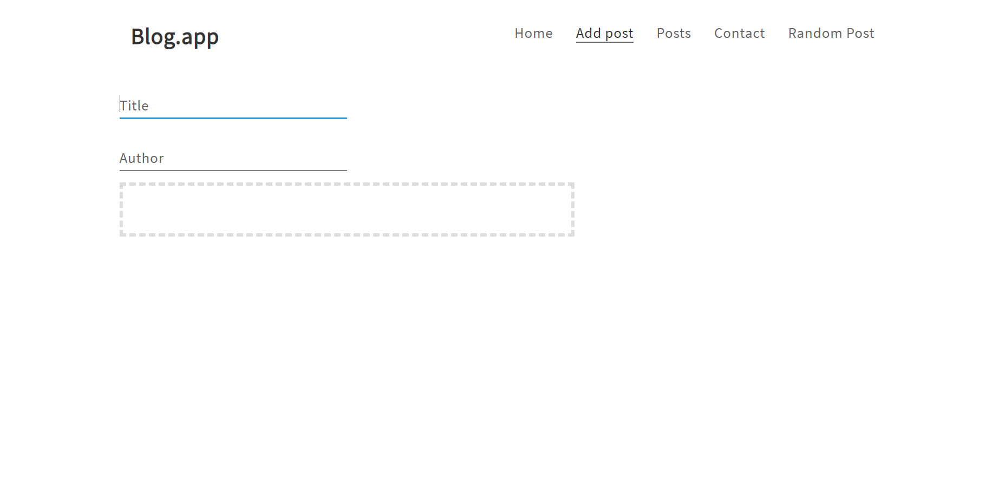
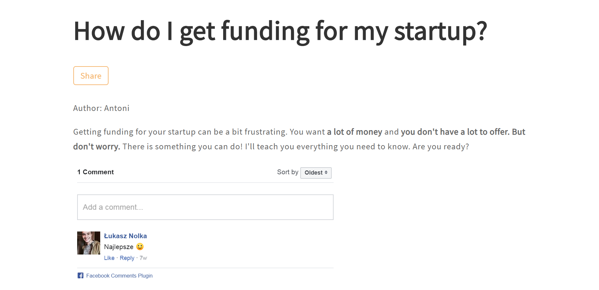

# blog-app
MERN blog app. You number of entries, add new post or edit existing. If you want, you can write a comment under selected post.

# Demo : 
App was deployed on Heroku server:

https://blog-mern-app.herokuapp.com

# Technologies (MERN stack) :
- React + Redux + Hooks
- Node + express + mongodb + mongo Atlas
- Medium editor
- Sass
- Axios
- Nodemailer
- and other...

# Preview

# Tasks :
`yarn install` to install package
`yarn start` to start project 

<b> ENJOY !</b>